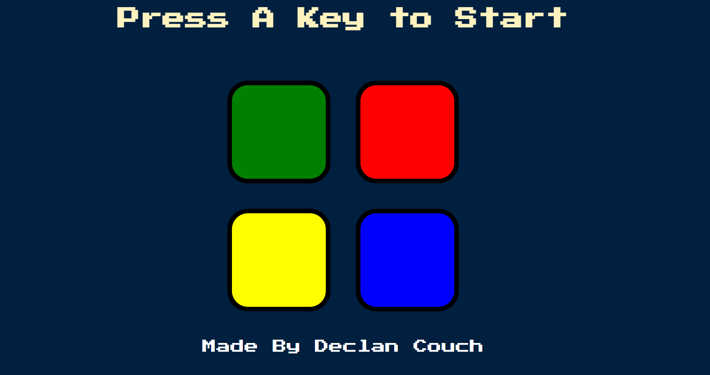

# Simon-Game

## Introduction

This GitHub repository presents the Simon Game, an interactive memory challenge designed to test and improve your reflexes and memory skills. The game is built using HTML, CSS, and JavaScript, and incorporates vibrant visuals and engaging audio effects to create an immersive gameplay experience.

## Repository Contents

- **index.html:** The main HTML file containing the structure of the game interface.
- **styles.css:** The CSS file that styles the game's visual elements.
- **index.js:** The JavaScript file powering the game's interactivity and logic.
- **sounds:** A directory containing audio files for each color button.

## Game Features

- Four colored buttons (green, red, yellow, blue) that light up in a random sequence.
- Each round, the sequence gets progressively longer and more complex.
- Players must remember and replicate the sequence by clicking the buttons in the correct order.
- Auditory feedback provided for each button click and game events (correct/incorrect sequence).
- A visual indicator (change in button opacity) for active button presses.

## Getting Started

1. **Clone the Repository:** Clone this repository to your local machine to get started with the game.
2. **Open index.html:** Launch the _index.html_ file in your browser to start playing the game.
3. **Gameplay:** Press any key to start the game. Follow the sequence of the colored buttons and replicate it by clicking on them.

## Development

- The game utilizes jQuery for DOM manipulation and event handling, enhancing the gameplay experience.
- CSS is used to design the layout and responsiveness of the game interface.
- JavaScript is employed to implement the game logic, including sequence generation, user input validation, and game progression.

## Contributing

Contributions, bug reports, and feature requests are welcome, just email me at [dcouch01@manhattan.edu](mailto:dcouch01@manhattan.edu).

[Feel free to play the game by clicking here](https://declancouch.github.io/Simon-Game/)

